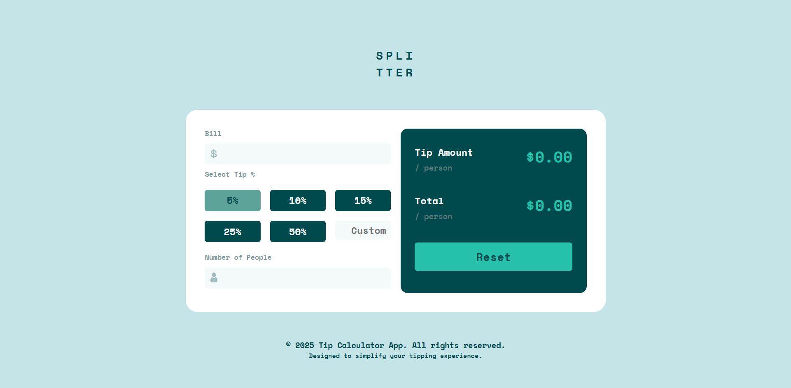

# Frontend Mentor - Tip Calculator App Solution

This is a solution to the [Tip calculator app challenge on Frontend Mentor](https://www.frontendmentor.io/challenges/tip-calculator-app-ugJNGbJUX). Frontend Mentor challenges help you improve your coding skills by building realistic projects.

## Table of Contents

- [Overview](#overview)
  - [The Challenge](#the-challenge)
  - [Screenshot](#screenshot)
  - [Links](#links)
- [My Process](#my-process)
  - [Built With](#built-with)
  - [What I Learned](#what-i-learned)
  - [Continued Development](#continued-development)
  - [Useful Resources](#useful-resources)
- [Author](#author)

## Overview

### The Challenge

Users should be able to:

- View the optimal layout for the app depending on their device's screen size
- See hover states for all interactive elements on the page
- Calculate the correct tip and total cost of the bill per person

### Screenshot

### Links

- Solution URL: [Add solution URL here](https://your-solution-url.com)
- Live Site URL: [Add live site URL here](https://your-live-site-url.com)

## My Process

### Built With

- Semantic HTML5 markup
- CSS custom properties
- Flexbox
- CSS Grid
- Mobile-first workflow
- Vanilla JavaScript

### What I Learned

During this project, I learned how to:

- Use CSS Grid and Flexbox for layout
- Implement responsive design using CSS custom properties and media queries
- Handle user input and form validation in JavaScript
- Calculate and display dynamic values based on user input

### Continued Development

In future projects, I want to continue focusing on:

- Improving my JavaScript skills, particularly with ES6+ features
- Enhancing my understanding of responsive design techniques
- Exploring more advanced CSS features and animations

### Useful Resources

- **[MDN Web Docs](https://developer.mozilla.org/)** - Comprehensive resource for web development documentation and tutorials.
- **[CSS-Tricks](https://css-tricks.com/)** - Helpful articles and guides on CSS and web design.

## Author

Frontend Mentor - [@abhi-zero](https://www.frontendmentor.io/profile/abhi-zero)

